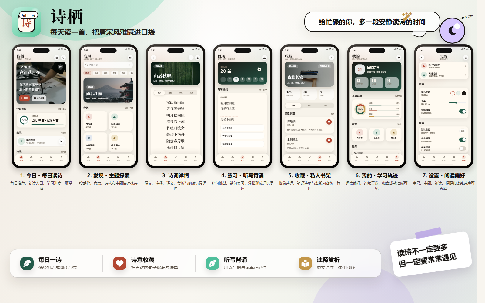
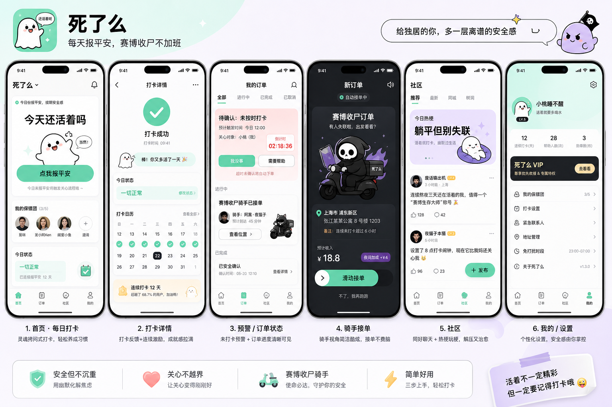
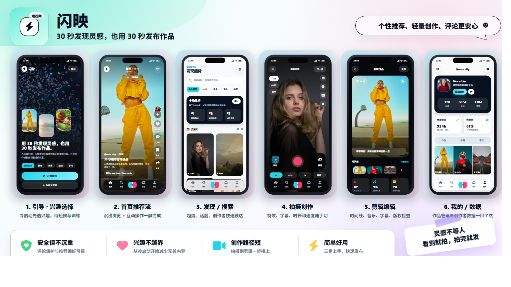
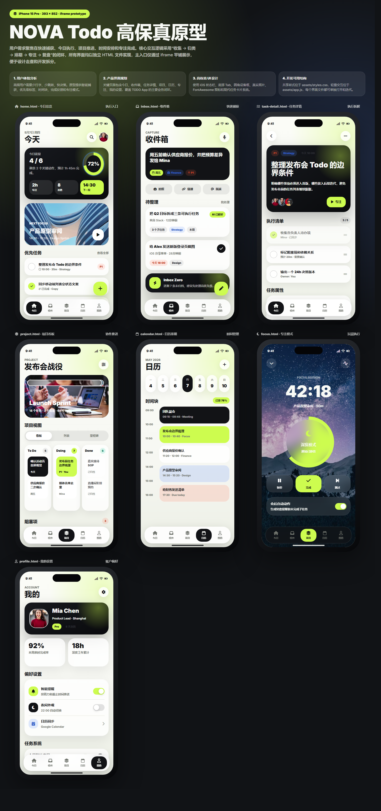
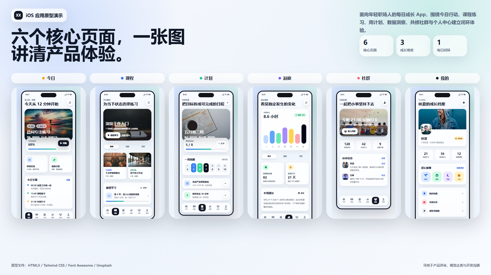

# AI 原型图作品集

> 这里记录我通过不同 prompt 生成的 App / Web 产品原型。每个目录代表一次独立的原型生成结果，包含页面 HTML、样式文件、交互脚本和用于首页展示的原型截图。

## 目录结构

```text
images/
├─ prototypes/   # 原型 HTML / CSS / JS
├─ screenshots/  # README 展示截图
└─ archive/      # 早期图片素材归档
```

## 内容索引

| 编号 | 原型项目 | 类型 | 原型入口 |
| --- | --- | --- | --- |
| 01 | 诗栖 App 高保真原型 | 古诗词学习 App | [index.html](./images/prototypes/poetry-app/index.html) |
| 02 | 死了么 App 高保真原型 | 安全确认 / 社区互助 App | [index.html](./images/prototypes/safety-check-app/index.html) |
| 03 | 闪映短视频 App 原型 | 短视频内容创作 App | [index.html](./images/prototypes/short-video-app/index.html) |
| 04 | NOVA Todo 高保真原型 | 任务管理 / 专注效率 App | [index.html](./images/prototypes/nova-todo/index.html) |
| 05 | XX 成长练习 App 原型 | 学习计划 / 自我成长 App | [index.html](./images/prototypes/growth-practice-app/index.html) |

## 01. 诗栖 App 高保真原型

**目录：** `images/prototypes/poetry-app/`

> [!TIP]
> **Prompt**
>
> ```text
> 我想开发一个 {古诗词 app}，现在需要输出高保真的原型图，请通过以下方式帮我完成所有界面的原型设计，并确保这些原界面可以直接用于开发：
>
> 1、用户体验分析：先分析这个 App 的主要功能和用户需求，确定核心交互逻辑。
> 2、产品界面规划：作为产品经理，定义关键界面，确保信息架构合理。
> 3、高保真 UI 设计：作为 UI 设计师，设计贴近真实 iOS/Android 设计规范的界面，使用现代化的 UI 元素，使其具有良好的视觉体验。
> 4、HTML 原型实现：使用 HTML + Tailwind CSS (或 Bootstrap) 生成所有原型界面，并使用 FontAwesome (或其他开源 UI 组件) 让界更加精美、接近真实的 App 设计。
> 拆分代码文件，保持结构清晰：
> 5、每个界面应作为独立的 HTML 文件存放，例如 home.html、profile.html、settings.html 等。
> - index.html 作为主入口，不直接写入所有界面的 HTML 代码，而是使用 iframe 的方式嵌入这些 HTML 片段，并将所有页面直接平铺示在 index 页面中，而不是跳转链接。
> - 真实感增强：
> - 界面尺寸应模拟 iPhone 15 Pro，并让界面圆角化，使其更像真实的手机界面。
> - 使用真实的 UI 图片，而非占位符图片 (可从 Unsplash、Pexels、Apple 官方 UI 资源中选择)。
> - 添加顶部状态栏 (模拟 iOS 状态栏)，并包含 App 导航栏 (类似 iOS 底部 Tab Bar)。
> 请按照以上要求生成完整的 HTML 代码，并确保其可用于实际开发。
> ```

### 原型截图



**主要页面：**

- [原型总览](./images/prototypes/poetry-app/index.html)
- [今日](./images/prototypes/poetry-app/home.html)
- [发现](./images/prototypes/poetry-app/discover.html)
- [诗词详情](./images/prototypes/poetry-app/poem.html)
- [练习](./images/prototypes/poetry-app/practice.html)
- [收藏](./images/prototypes/poetry-app/library.html)
- [我的](./images/prototypes/poetry-app/profile.html)
- [设置](./images/prototypes/poetry-app/settings.html)

---

## 02. 死了么 App 高保真原型

**目录：** `images/prototypes/safety-check-app/`

> [!TIP]
> **Prompt**
>
> ```text
> 我想开发一个类似外卖APP「饿了么」，APP叫「死了么」，用于养老的，每天问一句，以防独自一个人死在家里没人发现。APP也有骑手，哪里有人死了就去接单收尸。 注意这是专门为独居90后的年轻人设计的。风格要求清新好看、APP内的文案多用搞怪的网络用语。
> 现在需要输出高保真的原型图，请通过以下方式帮我完成所有界面的原型设计，并确保这些原型界面可以直接用于开发：
> 1、用户体验分析：先分析这个 App 的主要功能和用户需求，确定核心交互逻辑。
> 2、产品界面规划：作为产品经理，定义关键界面，确保信息架构合理。
> 3、高保真 UI 设计：作为 UI 设计师，设计贴近真实 iOS/Android 设计规范的界面，使用现代化的 UI 元素，使其具有良好的视觉体验。
> 4、HTML 原型实现：使用 HTML + Tailwind CSS（或 Bootstrap）生成所有原型界面，并使用 FontAwesome（或其他开源 UI 组件）让界面更加精美、接近真实的 App 设计。拆分代码文件，保持结构清晰：
> 5、每个界面应作为独立的 HTML 文件存放，例如 home.html、profile.html、settings.html 等。
> - index.html 作为主入口，不直接写入所有界面的 HTML 代码，而是使用 iframe 的方式嵌入这些 HTML 片段，并将所有页面直接平铺展示在 index 页面中，而不是跳转链接。
> - 真实感增强：
> - 界面尺寸应模拟 iPhone 15 Pro，并让界面圆角化，使其更像真实的手机界面。
> - 使用真实的 UI 图片，而非占位符图片（可从 Unsplash、Pexels、Apple 官方 UI 资源中选择）。
> - 添加顶部状态栏（模拟 iOS 状态栏），并包含 App 导航栏（类似 iOS 底部 Tab Bar）。
> 请按照以上要求生成完整的 HTML 代码，并确保其可用于实际开发。
> ```

### 原型截图



**主要页面：**

- [原型总览](./images/prototypes/safety-check-app/index.html)
- [首页](./images/prototypes/safety-check-app/home.html)
- [报平安](./images/prototypes/safety-check-app/checkin.html)
- [预警中心](./images/prototypes/safety-check-app/alerts.html)
- [订单详情](./images/prototypes/safety-check-app/order-detail.html)
- [骑手接单](./images/prototypes/safety-check-app/rider.html)
- [社区](./images/prototypes/safety-check-app/community.html)
- [我的](./images/prototypes/safety-check-app/profile.html)
- [新手设置](./images/prototypes/safety-check-app/onboarding.html)

---

## 03. 闪映短视频 App 原型

**目录：** `images/prototypes/short-video-app/`

> **Prompt**
>
> ```text
> 我想开发一个 {短视频类型的 App}，现在需要输出高保真的原型图，请通过以下方式帮我完成所有界面的原型设计，并确保这些原型界面可以直接用于开发：
>
> 用户体验分析：
> - 先分析这个 App 的主要功能和用户需求，确定核心交互逻辑。
> - 进行用户调研，了解目标用户的需求与痛点。
> - 对竞品进行分析，研究其他类似类型的 App（如 {短视频类型的 App}）功能和设计的优缺点。
>
> 产品界面规划：
> - 作为产品经理，定义关键界面，确保信息架构合理。
> - 根据功能优先级定义 MVP（最小可行产品）的核心功能，确保重要功能优先实现。
> - 制定迭代计划，确保开发进度可控，并逐步实现其他功能。
>
> 高保真 UI 设计：
> - 作为 UI 设计师，设计贴近真实 iOS/Android 设计规范的界面，使用现代化的 UI 元素，确保视觉体验良好。
> - 构建设计系统，规范颜色、字体、按钮等元素的样式。提供详细的风格指南，确保界面元素一致性。
>
> HTML 原型实现：
> - 使用 HTML + Tailwind CSS（或 Bootstrap）生成所有原型界面，并使用 FontAwesome（或其他 UI 组件）让界面更加精美，接近真实 App 设计。
> - 将每个界面作为独立 HTML 文件（如 home.html、profile.html、settings.html 等），并通过 iframe 嵌入到 index.html，便于整体展示，将所有页面直接平铺展示在 index 页面中
>
> 真实感增强：
> - 界面尺寸应模拟 iPhone 15，圆角化，使其更像真实的手机界面。
> - 使用真实的 UI 图片，而非占位符图片（可从 Unsplash、Pexels、Apple 官方 UI 资源中选择）。
> - 添加顶部状态栏（模拟 iOS 状态栏），并包含 App 导航栏（类似 iOS 底部 Tab Bar）。
>
> 交互设计与动画效果：
> - 展示主要交互逻辑（如页面切换、按钮点击、滑动列表等）。
> - 在原型中加入简化的动画效果，帮助更好地传达交互体验。
>
> 无障碍设计：
> - 确保 UI 元素有足够的对比度，文本可放大，按钮和链接可用屏幕阅读器识别。
> - 确保键盘和触控支持良好，交互体验流畅自然。
>
> 请按照以上要求生成完整的 HTML 代码，并确保其可用于实际开发。
> ```

### 原型截图



**主要页面：**

- [原型总览](./images/prototypes/short-video-app/index.html)
- [引导与兴趣选择](./images/prototypes/short-video-app/onboarding.html)
- [首页推荐流](./images/prototypes/short-video-app/home.html)
- [发现趋势](./images/prototypes/short-video-app/discover.html)
- [拍摄创作](./images/prototypes/short-video-app/create.html)
- [剪辑编辑](./images/prototypes/short-video-app/editor.html)
- [视频详情](./images/prototypes/short-video-app/video-detail.html)
- [消息中心](./images/prototypes/short-video-app/inbox.html)
- [个人主页](./images/prototypes/short-video-app/profile.html)
- [设置与安全](./images/prototypes/short-video-app/settings.html)

---

## 04. NOVA Todo 高保真原型

**目录：** `images/prototypes/nova-todo/`

> **Prompt**
>
> ```text
> 我想开发一个{很有设计逼格的TODO APP}，现在需要输出高保真的原型图，请通过以下方式帮我完成所有界面的原型设计，并确保这些原型界面可以直接用于开发：
> 1、用户体验分析：先分析这个 App 的主要功能和用户需求，确定核心交互逻辑。
> 2、产品界面规划：作为产品经理，定义关键界面，确保信息架构合理。
> 3、高保真 UI 设计：作为 UI 设计师，设计贴近真实 iOS/Android 设计规范的界面，使用现代化的 UI 元素，使其具有良好的视觉体验。
> 4、HTML 原型实现：使用 HTML + Tailwind CSS（或 Bootstrap）生成所有原型界面，并使用 FontAwesome（或其他开源 UI 组件）让界面更加精美、接近真实的 App 设计。拆分代码文件，保持结构清晰：
> 5、每个界面应作为独立的 HTML 文件存放，例如 home.html、profile.html、settings.html 等。
> - index.html 作为主入口，不直接写入所有界面的 HTML 代码，而是使用 iframe 的方式嵌入这些 HTML 片段，并将所有页面直接平铺展示在 index 页面中，而不是跳转链接。
> - 真实感增强：
> - 界面尺寸应模拟 iPhone 15 Pro，并让界面圆角化，使其更像真实的手机界面。
> - 使用真实的 UI 图片，而非占位符图片（可从 Unsplash、Pexels、Apple 官方 UI 资源中选择）。
> - 添加顶部状态栏（模拟 iOS 状态栏），并包含 App 导航栏（类似 iOS 底部 Tab Bar）。
>
> 请按照以上要求生成完整的 HTML 代码，并确保其可用于实际开发。
> ```

### 原型截图



**主要页面：**

- [原型总览](./images/prototypes/nova-todo/index.html)
- [今天](./images/prototypes/nova-todo/home.html)
- [收件箱](./images/prototypes/nova-todo/inbox.html)
- [日历](./images/prototypes/nova-todo/calendar.html)
- [项目](./images/prototypes/nova-todo/project.html)
- [任务详情](./images/prototypes/nova-todo/task-detail.html)
- [专注模式](./images/prototypes/nova-todo/focus.html)
- [我的](./images/prototypes/nova-todo/profile.html)

---

## 05. XX 成长练习 App 原型

**目录：** `images/prototypes/growth-practice-app/`

> [!TIP]
> **Prompt**
>
> ```text
> 你是一名精通 UI 设计和产品规划的全栈工程师，你的目标是完成一个"xx"iOS App 的开发。
>
> 你的核心任务是输出一套完整的APP原型图（HTML页面形式）来辅助后续的开发任务。
>
> 核心执行点：
>
> - 明确功能与页面： 请你构思并确定"xx"App的核心功能模块。基于这些模块，规划出需要设计的HTML页面清单。
> - 产品与UI/UX设计：
>   - 以产品经理的视角规划APP的关键功能、页面流程和交互逻辑。
>   - 以设计师的视角输出符合现代iOS App风格的、美观且用户友好的UI/UX。
>
> 技术规范：
>
> - 使用 HTML5、Font Awesome、Tailwind CSS 和必要的 JavaScript（用于基础交互）。
> - 图片素材请使用 Unsplash。
> - 代码应简洁，注重可读性。
>
> 输出要求：
>
> - 创建一个包含多个 HTML 页面的原型。
> - 主页面命名为 index.html，它可以整合或跳转到其他页面。
> - 非主页面HTML文件使用其对应的核心功能名称进行命名（英文，例如 courses.html, profile.html）。
> - 每个页面均需采用 iOS App 的风格生成。
> - index.html 中，每行展示两个主要功能模块的入口或页面预览。
> - 所有输出（包括代码内注释和页面文本）永远用简体中文。
> - 请以顶级UX的眼光和审美标准，创造令人满意的设计。
>
> 请直接开始设计并输出上述要求的HTML原型页面代码，从 index.html 开始，然后是其他你规划的核心功能页面。
> ```

### 原型截图



**主要页面：**

- [原型总览](./images/prototypes/growth-practice-app/index.html)
- [今日](./images/prototypes/growth-practice-app/today.html)
- [课程](./images/prototypes/growth-practice-app/courses.html)
- [计划](./images/prototypes/growth-practice-app/plan.html)
- [洞察](./images/prototypes/growth-practice-app/insights.html)
- [社群](./images/prototypes/growth-practice-app/community.html)
- [我的](./images/prototypes/growth-practice-app/profile.html)

---
