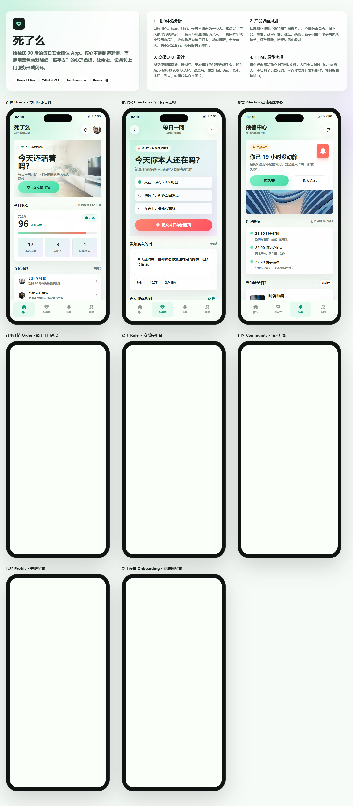

# AI 原型图作品集

> 这里记录我通过不同 prompt 生成的 App / Web 产品原型。每个目录代表一次独立的原型生成结果，包含页面 HTML、样式文件、交互脚本，部分项目还包含截图素材。

## 内容索引

| 编号 | 原型项目 | 类型 | 入口 |
| --- | --- | --- | --- |
| 01 | 诗栖 App 高保真原型 | 古诗词学习 App | [index.html](./images/app-1-app-2-3-ui/index.html) |
| 02 | 死了么 App 高保真原型 | 安全确认 / 社区互助 App | [index.html](./images/app-app-app-90-app-1/index.html) |
| 03 | 闪映短视频 App 原型 | 短视频内容创作 App | [index.html](./images/app-app-app-app-mvp-ui/index.html) |
| 04 | NOVA Todo 高保真原型 | 任务管理 / 专注效率 App | [index.html](./images/todo-app-1-app-2-3/index.html) |
| 05 | XX 成长练习 App 原型 | 学习计划 / 自我成长 App | [index.html](./images/ui-xx-ios-app-app-html/index.html) |

## 如何查看

GitHub 会把 `.html` 文件作为代码展示。如果想看到真正的原型页面效果，建议把仓库下载到本地后，双击对应目录里的 `index.html` 打开。

如果后续开启 GitHub Pages，也可以把这些 HTML 原型直接作为在线可访问页面。

---

## 01. 诗栖 App 高保真原型

**目录：** `images/app-1-app-2-3-ui/`

一个面向古诗词学习者的移动端原型，覆盖每日推荐、诗词发现、诗词详情、练习、收藏、个人中心和设置页面。

**主要页面：**

- [原型总览](./images/app-1-app-2-3-ui/index.html)
- [今日](./images/app-1-app-2-3-ui/home.html)
- [发现](./images/app-1-app-2-3-ui/discover.html)
- [诗词详情](./images/app-1-app-2-3-ui/poem.html)
- [练习](./images/app-1-app-2-3-ui/practice.html)
- [收藏](./images/app-1-app-2-3-ui/library.html)
- [我的](./images/app-1-app-2-3-ui/profile.html)
- [设置](./images/app-1-app-2-3-ui/settings.html)

---

## 02. 死了么 App 高保真原型

**目录：** `images/app-app-app-90-app-1/`

一个带有黑色幽默表达的安全确认与社区互助原型，围绕“每日报平安、超时预警、骑手上门、安全查看单、社区广场”等场景展开。

### 原型截图



**主要页面：**

- [原型总览](./images/app-app-app-90-app-1/index.html)
- [首页](./images/app-app-app-90-app-1/home.html)
- [报平安](./images/app-app-app-90-app-1/checkin.html)
- [预警中心](./images/app-app-app-90-app-1/alerts.html)
- [订单详情](./images/app-app-app-90-app-1/order-detail.html)
- [骑手接单](./images/app-app-app-90-app-1/rider.html)
- [社区](./images/app-app-app-90-app-1/community.html)
- [我的](./images/app-app-app-90-app-1/profile.html)
- [新手设置](./images/app-app-app-90-app-1/onboarding.html)

---

## 03. 闪映短视频 App 原型

**目录：** `images/app-app-app-app-mvp-ui/`

一个短视频内容创作 App 原型，包含引导、首页推荐流、发现、拍摄、剪辑、评论详情、消息中心、个人主页和设置安全等页面。

**主要页面：**

- [原型总览](./images/app-app-app-app-mvp-ui/index.html)
- [引导与兴趣选择](./images/app-app-app-app-mvp-ui/onboarding.html)
- [首页推荐流](./images/app-app-app-app-mvp-ui/home.html)
- [发现趋势](./images/app-app-app-app-mvp-ui/discover.html)
- [拍摄创作](./images/app-app-app-app-mvp-ui/create.html)
- [剪辑编辑](./images/app-app-app-app-mvp-ui/editor.html)
- [视频详情](./images/app-app-app-app-mvp-ui/video-detail.html)
- [消息中心](./images/app-app-app-app-mvp-ui/inbox.html)
- [个人主页](./images/app-app-app-app-mvp-ui/profile.html)
- [设置与安全](./images/app-app-app-app-mvp-ui/settings.html)

---

## 04. NOVA Todo 高保真原型

**目录：** `images/todo-app-1-app-2-3/`

一个任务管理与专注效率类 App 原型，覆盖今日任务、收件箱、日历、项目、任务详情、专注计时和个人设置等核心效率场景。

**主要页面：**

- [原型总览](./images/todo-app-1-app-2-3/index.html)
- [今天](./images/todo-app-1-app-2-3/home.html)
- [收件箱](./images/todo-app-1-app-2-3/inbox.html)
- [日历](./images/todo-app-1-app-2-3/calendar.html)
- [项目](./images/todo-app-1-app-2-3/project.html)
- [任务详情](./images/todo-app-1-app-2-3/task-detail.html)
- [专注模式](./images/todo-app-1-app-2-3/focus.html)
- [我的](./images/todo-app-1-app-2-3/profile.html)

---

## 05. XX 成长练习 App 原型

**目录：** `images/ui-xx-ios-app-app-html/`

一个围绕课程、计划、洞察、社群和个人成长档案设计的 iOS 风格原型，适合记录自我成长、学习计划和每日练习类产品方向。

**主要页面：**

- [原型总览](./images/ui-xx-ios-app-app-html/index.html)
- [今日](./images/ui-xx-ios-app-app-html/today.html)
- [课程](./images/ui-xx-ios-app-app-html/courses.html)
- [计划](./images/ui-xx-ios-app-app-html/plan.html)
- [洞察](./images/ui-xx-ios-app-app-html/insights.html)
- [社群](./images/ui-xx-ios-app-app-html/community.html)
- [我的](./images/ui-xx-ios-app-app-html/profile.html)

---

## 更新方式

新增一个原型时，建议在 `images/` 下新建一个独立目录，并在本文件中追加一个新的案例区块。

```text
images/
└─ your-new-prototype/
   ├─ index.html
   ├─ assets/
   └─ ...
```

常用上传命令：

```powershell
git add .
git commit -m "update prototype showcase"
git push
```
